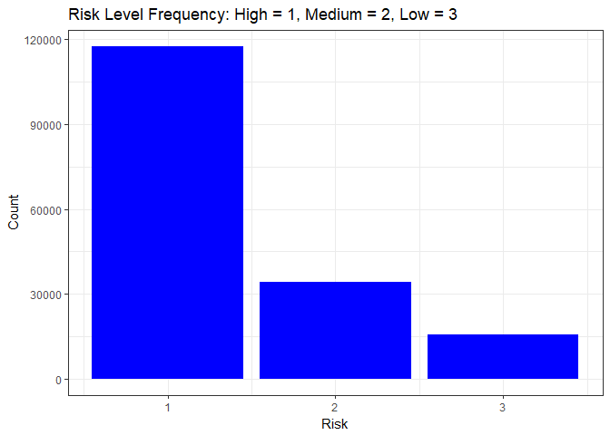
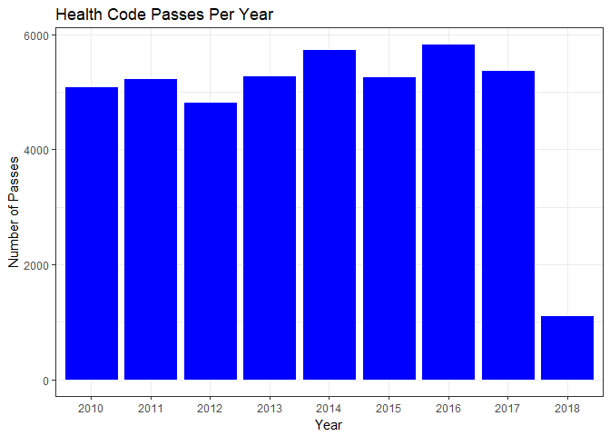
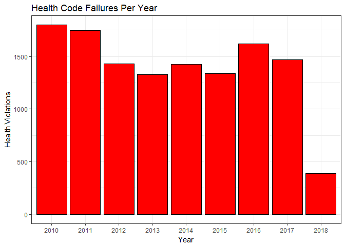
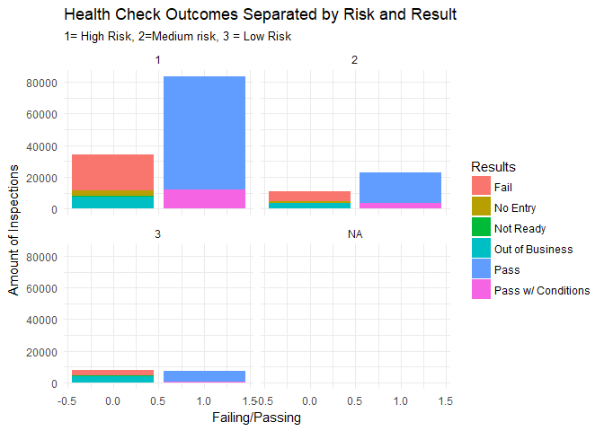

Problemset 1
================
Kristopher Nichols
April 16, 2018"

Libraries

Load Data

    ## # A tibble: 51,344 x 15
    ##    `Inspection ID`                           `DBA Name` `License #`
    ##              <int>                                <chr>       <int>
    ##  1         2159838                                 IHOP       50037
    ##  2         2159999                        THE BLANCHARD     2373807
    ##  3         2159995     WENDY'S OLD FASHIONED HAMBURGERS     2314101
    ##  4         2159984                     SIMON TACOS INC.     2496221
    ##  5         2159980            BROWNSTONE TAVERN & GRILL       39851
    ##  6         2159926               STEINGOLD'S OF CHICAGO     2543071
    ##  7         2159779                      MARISCOS ALMADA     2483049
    ##  8         2159977              RESTAURANT EL ASADOR II     2179622
    ##  9         2159876 MONTESSORI ACADEMY OF CHICAGO I, LLC     2215936
    ## 10         2159874 MONTESSORI ACADEMY OF CHICAGO I, LLC     2215935
    ## # ... with 51,334 more rows, and 12 more variables: `Facility Type` <chr>,
    ## #   Risk <chr>, Zip <int>, `Inspection Date` <chr>, `Inspection
    ## #   Type` <chr>, Results <chr>, Violations <chr>, Year <chr>, Pass <dbl>,
    ## #   Fail <dbl>, ResultsCoded <dbl>, Risknumb <dbl>

1: Data Location
================

The City of Chicago Food Inspections Data can be accessed at [this link](https://data.cityofchicago.org/Health-Human-Services/Food-Inspections/4ijn-s7e5/data). The data is stored through the Chicago Data Portal database. There are multiple features which allow the data to be manipulated and vizualized in the window, but it can also be exported in multiple formats. The data set is owned by the Chicago Department of Public Health.

2: Papers using this database
=============================

-   Offce of Inspector General, City of Chicago. (2016). Chicago Department of Public Health Food Establishment Inspection Audit. Chicago. Retrieved from <http://chicagoinspectorgeneral.org/wp-content/uploads/2016/11/Audit-of-CDPH> -Food-Establishment-Inspections.pdf
-   Ho, D. E. (2012). Fudging the Nudge: Information Disclosure and Restaurant Grading. The Yale Law Journal, 122(3), 574688.
-   McBride, K., Aavik, G., Kalvet, T., & Krimmer, R. (2018). Co-creating an Open Government Data Driven Public Service: The Case of Chicagos Food Inspection Forecasting Model. The 51st Hawaii International Conference on System Sciences (HICSS). <https://doi.org/10.24251>

I was able to locate three papers that have used this dataset.

3: Data Collection
==================

This information is derived from inspections of restaurants and other food establishments in Chicago from January 1, 2010 to the present. Inspections are performed by staff from the Chicago Department of Public Health's Food Protection Program using a standardized procedure. "The results of the inspection are inputted into a database, then reviewed and approved by a State of Illinois Licensed Environmental Health Practitioner (LEHP)"

4: Descriptive Statistics
=========================

<table class="table table-striped" style="width: auto !important; ">
<thead>
<tr>
<th style="text-align:left;">
</th>
<th style="text-align:left;">
Inspection ID
</th>
<th style="text-align:left;">
DBA Name
</th>
<th style="text-align:left;">
License \#
</th>
<th style="text-align:left;">
Facility Type
</th>
<th style="text-align:left;">
     Risk </th>

<th style="text-align:left;">
      Zip </th>

<th style="text-align:left;">
Inspection Date
</th>
<th style="text-align:left;">
Inspection Type
</th>
<th style="text-align:left;">
Results
</th>
<th style="text-align:left;">
Violations
</th>
<th style="text-align:left;">
     Year </th>

<th style="text-align:left;">
      Pass </th>

<th style="text-align:left;">
      Fail </th>

<th style="text-align:left;">
ResultsCoded
</th>
<th style="text-align:left;">
    Risknumb </th>

</tr>
</thead>
<tbody>
<tr>
<td style="text-align:left;">
</td>
<td style="text-align:left;">
Min. : 44247
</td>
<td style="text-align:left;">
Length:167412
</td>
<td style="text-align:left;">
Min. : 0
</td>
<td style="text-align:left;">
Length:167412
</td>
<td style="text-align:left;">
Length:167412
</td>
<td style="text-align:left;">
Min. :60007
</td>
<td style="text-align:left;">
Length:167412
</td>
<td style="text-align:left;">
Length:167412
</td>
<td style="text-align:left;">
Length:167412
</td>
<td style="text-align:left;">
Length:167412
</td>
<td style="text-align:left;">
Length:167412
</td>
<td style="text-align:left;">
Min. :0
</td>
<td style="text-align:left;">
Min. :0
</td>
<td style="text-align:left;">
Min. :1
</td>
<td style="text-align:left;">
Min. :1
</td>
</tr>
<tr>
<td style="text-align:left;">
</td>
<td style="text-align:left;">
1st Qu.:1084275
</td>
<td style="text-align:left;">
Class :character
</td>
<td style="text-align:left;">
1st Qu.:1145075
</td>
<td style="text-align:left;">
Class :character
</td>
<td style="text-align:left;">
Class :character
</td>
<td style="text-align:left;">
1st Qu.:60614
</td>
<td style="text-align:left;">
Class :character
</td>
<td style="text-align:left;">
Class :character
</td>
<td style="text-align:left;">
Class :character
</td>
<td style="text-align:left;">
Class :character
</td>
<td style="text-align:left;">
Class :character
</td>
<td style="text-align:left;">
1st Qu.:0
</td>
<td style="text-align:left;">
1st Qu.:0
</td>
<td style="text-align:left;">
1st Qu.:1
</td>
<td style="text-align:left;">
1st Qu.:1
</td>
</tr>
<tr>
<td style="text-align:left;">
</td>
<td style="text-align:left;">
Median :1396098
</td>
<td style="text-align:left;">
Mode :character
</td>
<td style="text-align:left;">
Median :1937764
</td>
<td style="text-align:left;">
Mode :character
</td>
<td style="text-align:left;">
Mode :character
</td>
<td style="text-align:left;">
Median :60625
</td>
<td style="text-align:left;">
Mode :character
</td>
<td style="text-align:left;">
Mode :character
</td>
<td style="text-align:left;">
Mode :character
</td>
<td style="text-align:left;">
Mode :character
</td>
<td style="text-align:left;">
Mode :character
</td>
<td style="text-align:left;">
Median :1
</td>
<td style="text-align:left;">
Median :0
</td>
<td style="text-align:left;">
Median :1
</td>
<td style="text-align:left;">
Median :1
</td>
</tr>
<tr>
<td style="text-align:left;">
</td>
<td style="text-align:left;">
Mean :1308724
</td>
<td style="text-align:left;">
NA
</td>
<td style="text-align:left;">
Mean :1543089
</td>
<td style="text-align:left;">
NA
</td>
<td style="text-align:left;">
NA
</td>
<td style="text-align:left;">
Mean :60629
</td>
<td style="text-align:left;">
NA
</td>
<td style="text-align:left;">
NA
</td>
<td style="text-align:left;">
NA
</td>
<td style="text-align:left;">
NA
</td>
<td style="text-align:left;">
NA
</td>
<td style="text-align:left;">
Mean :1
</td>
<td style="text-align:left;">
Mean :0
</td>
<td style="text-align:left;">
Mean :2
</td>
<td style="text-align:left;">
Mean :1
</td>
</tr>
<tr>
<td style="text-align:left;">
</td>
<td style="text-align:left;">
3rd Qu.:1751998
</td>
<td style="text-align:left;">
NA
</td>
<td style="text-align:left;">
3rd Qu.:2189389
</td>
<td style="text-align:left;">
NA
</td>
<td style="text-align:left;">
NA
</td>
<td style="text-align:left;">
3rd Qu.:60643
</td>
<td style="text-align:left;">
NA
</td>
<td style="text-align:left;">
NA
</td>
<td style="text-align:left;">
NA
</td>
<td style="text-align:left;">
NA
</td>
<td style="text-align:left;">
NA
</td>
<td style="text-align:left;">
3rd Qu.:1
</td>
<td style="text-align:left;">
3rd Qu.:0
</td>
<td style="text-align:left;">
3rd Qu.:4
</td>
<td style="text-align:left;">
3rd Qu.:2
</td>
</tr>
<tr>
<td style="text-align:left;">
</td>
<td style="text-align:left;">
Max. :2160035
</td>
<td style="text-align:left;">
NA
</td>
<td style="text-align:left;">
Max. :9999999
</td>
<td style="text-align:left;">
NA
</td>
<td style="text-align:left;">
NA
</td>
<td style="text-align:left;">
Max. :60827
</td>
<td style="text-align:left;">
NA
</td>
<td style="text-align:left;">
NA
</td>
<td style="text-align:left;">
NA
</td>
<td style="text-align:left;">
NA
</td>
<td style="text-align:left;">
NA
</td>
<td style="text-align:left;">
Max. :1
</td>
<td style="text-align:left;">
Max. :1
</td>
<td style="text-align:left;">
Max. :6
</td>
<td style="text-align:left;">
Max. :3
</td>
</tr>
<tr>
<td style="text-align:left;">
</td>
<td style="text-align:left;">
NA
</td>
<td style="text-align:left;">
NA
</td>
<td style="text-align:left;">
NA's :15
</td>
<td style="text-align:left;">
NA
</td>
<td style="text-align:left;">
NA
</td>
<td style="text-align:left;">
NA's :72
</td>
<td style="text-align:left;">
NA
</td>
<td style="text-align:left;">
NA
</td>
<td style="text-align:left;">
NA
</td>
<td style="text-align:left;">
NA
</td>
<td style="text-align:left;">
NA
</td>
<td style="text-align:left;">
NA's :61
</td>
<td style="text-align:left;">
NA's :61
</td>
<td style="text-align:left;">
NA's :61
</td>
<td style="text-align:left;">
NA's :88
</td>
</tr>
</tbody>
</table>
<table class="table table-striped" style="width: auto !important; ">
<thead>
<tr>
<th style="text-align:left;">
</th>
<th style="text-align:right;">
Inspection ID
</th>
<th style="text-align:left;">
DBA Name
</th>
<th style="text-align:right;">
License \#
</th>
<th style="text-align:left;">
Facility Type
</th>
<th style="text-align:left;">
Risk
</th>
<th style="text-align:right;">
Zip
</th>
<th style="text-align:left;">
Inspection Date
</th>
<th style="text-align:left;">
Inspection Type
</th>
<th style="text-align:left;">
Results
</th>
<th style="text-align:left;">
Violations
</th>
<th style="text-align:left;">
Year
</th>
<th style="text-align:right;">
Pass
</th>
<th style="text-align:right;">
Fail
</th>
<th style="text-align:right;">
ResultsCoded
</th>
<th style="text-align:right;">
Risknumb
</th>
</tr>
</thead>
<tbody>
<tr>
<td style="text-align:left;">
nbr.val
</td>
<td style="text-align:right;">
167412.00
</td>
<td style="text-align:left;">
NA
</td>
<td style="text-align:right;">
167397.00
</td>
<td style="text-align:left;">
NA
</td>
<td style="text-align:left;">
NA
</td>
<td style="text-align:right;">
167340.00
</td>
<td style="text-align:left;">
NA
</td>
<td style="text-align:left;">
NA
</td>
<td style="text-align:left;">
NA
</td>
<td style="text-align:left;">
NA
</td>
<td style="text-align:left;">
NA
</td>
<td style="text-align:right;">
167351.00
</td>
<td style="text-align:right;">
167351.00
</td>
<td style="text-align:right;">
167351.00
</td>
<td style="text-align:right;">
167324.00
</td>
</tr>
<tr>
<td style="text-align:left;">
nbr.null
</td>
<td style="text-align:right;">
0.00
</td>
<td style="text-align:left;">
NA
</td>
<td style="text-align:right;">
456.00
</td>
<td style="text-align:left;">
NA
</td>
<td style="text-align:left;">
NA
</td>
<td style="text-align:right;">
0.00
</td>
<td style="text-align:left;">
NA
</td>
<td style="text-align:left;">
NA
</td>
<td style="text-align:left;">
NA
</td>
<td style="text-align:left;">
NA
</td>
<td style="text-align:left;">
NA
</td>
<td style="text-align:right;">
53415.00
</td>
<td style="text-align:right;">
134910.00
</td>
<td style="text-align:right;">
0.00
</td>
<td style="text-align:right;">
0.00
</td>
</tr>
<tr>
<td style="text-align:left;">
nbr.na
</td>
<td style="text-align:right;">
0.00
</td>
<td style="text-align:left;">
NA
</td>
<td style="text-align:right;">
15.00
</td>
<td style="text-align:left;">
NA
</td>
<td style="text-align:left;">
NA
</td>
<td style="text-align:right;">
72.00
</td>
<td style="text-align:left;">
NA
</td>
<td style="text-align:left;">
NA
</td>
<td style="text-align:left;">
NA
</td>
<td style="text-align:left;">
NA
</td>
<td style="text-align:left;">
NA
</td>
<td style="text-align:right;">
61.00
</td>
<td style="text-align:right;">
61.00
</td>
<td style="text-align:right;">
61.00
</td>
<td style="text-align:right;">
88.00
</td>
</tr>
<tr>
<td style="text-align:left;">
min
</td>
<td style="text-align:right;">
44247.00
</td>
<td style="text-align:left;">
NA
</td>
<td style="text-align:right;">
0.00
</td>
<td style="text-align:left;">
NA
</td>
<td style="text-align:left;">
NA
</td>
<td style="text-align:right;">
60007.00
</td>
<td style="text-align:left;">
NA
</td>
<td style="text-align:left;">
NA
</td>
<td style="text-align:left;">
NA
</td>
<td style="text-align:left;">
NA
</td>
<td style="text-align:left;">
NA
</td>
<td style="text-align:right;">
0.00
</td>
<td style="text-align:right;">
0.00
</td>
<td style="text-align:right;">
1.00
</td>
<td style="text-align:right;">
1.00
</td>
</tr>
<tr>
<td style="text-align:left;">
max
</td>
<td style="text-align:right;">
2160035.00
</td>
<td style="text-align:left;">
NA
</td>
<td style="text-align:right;">
9999999.00
</td>
<td style="text-align:left;">
NA
</td>
<td style="text-align:left;">
NA
</td>
<td style="text-align:right;">
60827.00
</td>
<td style="text-align:left;">
NA
</td>
<td style="text-align:left;">
NA
</td>
<td style="text-align:left;">
NA
</td>
<td style="text-align:left;">
NA
</td>
<td style="text-align:left;">
NA
</td>
<td style="text-align:right;">
1.00
</td>
<td style="text-align:right;">
1.00
</td>
<td style="text-align:right;">
6.00
</td>
<td style="text-align:right;">
3.00
</td>
</tr>
<tr>
<td style="text-align:left;">
range
</td>
<td style="text-align:right;">
2115788.00
</td>
<td style="text-align:left;">
NA
</td>
<td style="text-align:right;">
9999999.00
</td>
<td style="text-align:left;">
NA
</td>
<td style="text-align:left;">
NA
</td>
<td style="text-align:right;">
820.00
</td>
<td style="text-align:left;">
NA
</td>
<td style="text-align:left;">
NA
</td>
<td style="text-align:left;">
NA
</td>
<td style="text-align:left;">
NA
</td>
<td style="text-align:left;">
NA
</td>
<td style="text-align:right;">
1.00
</td>
<td style="text-align:right;">
1.00
</td>
<td style="text-align:right;">
5.00
</td>
<td style="text-align:right;">
2.00
</td>
</tr>
<tr>
<td style="text-align:left;">
sum
</td>
<td style="text-align:right;">
NA
</td>
<td style="text-align:left;">
NA
</td>
<td style="text-align:right;">
NA
</td>
<td style="text-align:left;">
NA
</td>
<td style="text-align:left;">
NA
</td>
<td style="text-align:right;">
NA
</td>
<td style="text-align:left;">
NA
</td>
<td style="text-align:left;">
NA
</td>
<td style="text-align:left;">
NA
</td>
<td style="text-align:left;">
NA
</td>
<td style="text-align:left;">
NA
</td>
<td style="text-align:right;">
113936.00
</td>
<td style="text-align:right;">
32441.00
</td>
<td style="text-align:right;">
404492.00
</td>
<td style="text-align:right;">
232661.00
</td>
</tr>
<tr>
<td style="text-align:left;">
median
</td>
<td style="text-align:right;">
1396098.50
</td>
<td style="text-align:left;">
NA
</td>
<td style="text-align:right;">
1937764.00
</td>
<td style="text-align:left;">
NA
</td>
<td style="text-align:left;">
NA
</td>
<td style="text-align:right;">
60625.00
</td>
<td style="text-align:left;">
NA
</td>
<td style="text-align:left;">
NA
</td>
<td style="text-align:left;">
NA
</td>
<td style="text-align:left;">
NA
</td>
<td style="text-align:left;">
NA
</td>
<td style="text-align:right;">
1.00
</td>
<td style="text-align:right;">
0.00
</td>
<td style="text-align:right;">
1.00
</td>
<td style="text-align:right;">
1.00
</td>
</tr>
<tr>
<td style="text-align:left;">
mean
</td>
<td style="text-align:right;">
1308723.70
</td>
<td style="text-align:left;">
NA
</td>
<td style="text-align:right;">
1543088.76
</td>
<td style="text-align:left;">
NA
</td>
<td style="text-align:left;">
NA
</td>
<td style="text-align:right;">
60629.06
</td>
<td style="text-align:left;">
NA
</td>
<td style="text-align:left;">
NA
</td>
<td style="text-align:left;">
NA
</td>
<td style="text-align:left;">
NA
</td>
<td style="text-align:left;">
NA
</td>
<td style="text-align:right;">
0.68
</td>
<td style="text-align:right;">
0.19
</td>
<td style="text-align:right;">
2.42
</td>
<td style="text-align:right;">
1.39
</td>
</tr>
<tr>
<td style="text-align:left;">
SE.mean
</td>
<td style="text-align:right;">
1429.22
</td>
<td style="text-align:left;">
NA
</td>
<td style="text-align:right;">
2160.67
</td>
<td style="text-align:left;">
NA
</td>
<td style="text-align:left;">
NA
</td>
<td style="text-align:right;">
0.06
</td>
<td style="text-align:left;">
NA
</td>
<td style="text-align:left;">
NA
</td>
<td style="text-align:left;">
NA
</td>
<td style="text-align:left;">
NA
</td>
<td style="text-align:left;">
NA
</td>
<td style="text-align:right;">
0.00
</td>
<td style="text-align:right;">
0.00
</td>
<td style="text-align:right;">
0.00
</td>
<td style="text-align:right;">
0.00
</td>
</tr>
<tr>
<td style="text-align:left;">
CI.mean.0.95
</td>
<td style="text-align:right;">
2801.24
</td>
<td style="text-align:left;">
NA
</td>
<td style="text-align:right;">
4234.86
</td>
<td style="text-align:left;">
NA
</td>
<td style="text-align:left;">
NA
</td>
<td style="text-align:right;">
0.11
</td>
<td style="text-align:left;">
NA
</td>
<td style="text-align:left;">
NA
</td>
<td style="text-align:left;">
NA
</td>
<td style="text-align:left;">
NA
</td>
<td style="text-align:left;">
NA
</td>
<td style="text-align:right;">
0.00
</td>
<td style="text-align:right;">
0.00
</td>
<td style="text-align:right;">
0.01
</td>
<td style="text-align:right;">
0.00
</td>
</tr>
<tr>
<td style="text-align:left;">
var
</td>
<td style="text-align:right;">
341967185271.26
</td>
<td style="text-align:left;">
NA
</td>
<td style="text-align:right;">
781490954625.24
</td>
<td style="text-align:left;">
NA
</td>
<td style="text-align:left;">
NA
</td>
<td style="text-align:right;">
506.41
</td>
<td style="text-align:left;">
NA
</td>
<td style="text-align:left;">
NA
</td>
<td style="text-align:left;">
NA
</td>
<td style="text-align:left;">
NA
</td>
<td style="text-align:left;">
NA
</td>
<td style="text-align:right;">
0.22
</td>
<td style="text-align:right;">
0.16
</td>
<td style="text-align:right;">
3.96
</td>
<td style="text-align:right;">
0.42
</td>
</tr>
<tr>
<td style="text-align:left;">
std.dev
</td>
<td style="text-align:right;">
584779.60
</td>
<td style="text-align:left;">
NA
</td>
<td style="text-align:right;">
884019.77
</td>
<td style="text-align:left;">
NA
</td>
<td style="text-align:left;">
NA
</td>
<td style="text-align:right;">
22.50
</td>
<td style="text-align:left;">
NA
</td>
<td style="text-align:left;">
NA
</td>
<td style="text-align:left;">
NA
</td>
<td style="text-align:left;">
NA
</td>
<td style="text-align:left;">
NA
</td>
<td style="text-align:right;">
0.47
</td>
<td style="text-align:right;">
0.40
</td>
<td style="text-align:right;">
1.99
</td>
<td style="text-align:right;">
0.65
</td>
</tr>
<tr>
<td style="text-align:left;">
coef.var
</td>
<td style="text-align:right;">
0.45
</td>
<td style="text-align:left;">
NA
</td>
<td style="text-align:right;">
0.57
</td>
<td style="text-align:left;">
NA
</td>
<td style="text-align:left;">
NA
</td>
<td style="text-align:right;">
0.00
</td>
<td style="text-align:left;">
NA
</td>
<td style="text-align:left;">
NA
</td>
<td style="text-align:left;">
NA
</td>
<td style="text-align:left;">
NA
</td>
<td style="text-align:left;">
NA
</td>
<td style="text-align:right;">
0.68
</td>
<td style="text-align:right;">
2.04
</td>
<td style="text-align:right;">
0.82
</td>
<td style="text-align:right;">
0.47
</td>
</tr>
</tbody>
</table>
These tables show various descriptive statistics for the variables included in the dataset. Some are character variables and thus indicate NAs for the descriptive statistics.

5. Data Vizualization
=====================

 \* As can be seen in these graphs health code "passes" seem to be rising over the past years with failures slowly decreasing. These data are promising as they imply that the threat of the checks are becoming more substantial in motivating business to not fail.

6. Conditional Data
===================

